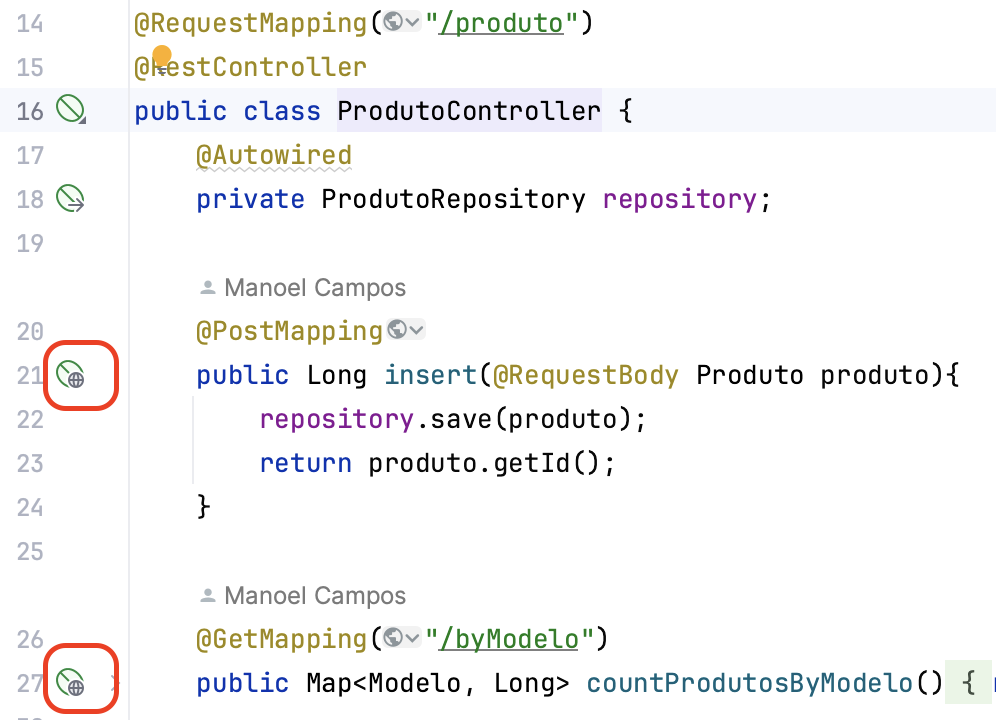
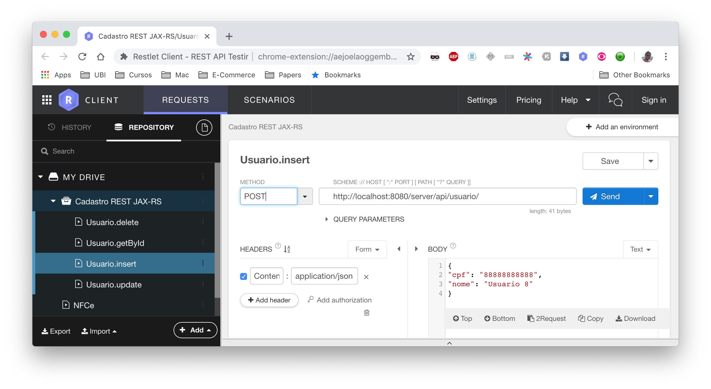

= Projeto de exemplo de API REST com SpringBoot para uma Loja Virtual image:https://github.com/manoelcampos/loja-virtual-springboot-rest/actions/workflows/build.yml/badge.svg[maven,link=https://github.com/manoelcampos/loja-virtual-springboot-rest/actions/workflows/build.yml]

== Configurar Ambiente de Desenvolvimento

=== JDK

Requer o JDK 17 que pode ser instalado no ubuntu com:

[source,bash]
----
sudo apt update
sudo apt install openjdk-17-jdk
----

Ou usando o http://sdkman.io[sdkman].

=== Implementando Serviços (APIs) REST

Um serviço REST fornecer as famosas operações CRUD (Create, Read, Update e Delete), que permitem inserir (Criar), obter (Ler), alterar (Atualizar) e deletar recursos (como arquivos ou registros em um banco de dados).
Tais métodos CRUD devem ser associados a determinados verbos HTTP. A tabela abaixo apresenta a associação entre estes verbos, operações CRUD e comandos SQL (quando as operações utilizarem um banco de dados).

|===
|*Verbo (Método) HTTP* |*Operação CRUD* |*Comando SQL* | Código de Status HTTP
|POST                  |**C**reate      | insert       | 201 (Created)
|GET                   |**R**ead        | select       | 200 (OK)
|PUT                   |**U**pdate      | update       | 204 (No Content)
|DELETE                |**D**elete      | delete       | 204 (No Content)
|===

NOTE: * 204 (No Content): quando nenhum dado for retornado pelo endpoint

=== IDE

O melhor IDE para desenvolvimento do projeto é o IntelliJ, pois tem excelente suporte ao Spring.

Como estamos usando http://projectlombok.org[Lombok] e JPA, é interessante instalar a extensão https://plugins.jetbrains.com/plugin/15075-jpa-buddy[JPA Buddy] para mostrar warnings quando as anotações do Lombok não estiverem sendo usadas da melhor forma.

Ao abrir o projeto no IntelliJ, ele também pede para habilitar o "Processamento de Anotações" para o Lombok funcionar.
Assim, tal opção precisa ser habilitada.

=== Configurações do Projeto

O arquivo link:src/main/resources/application.properties[application.properties] contém as configurações do projeto.
Algumas configurações são definidas por meio de variáveis de ambiente.

O projeto usa a biblioteca https://github.com/paulschwarz/spring-dotenv[spring-dotenv] para ler arquivos .env automaticamente.
Assim, você deve copiar o arquivo link:.env.example[.env.example] como `.env` e alterar as configurações que desejar
(veja comentários dentro do arquivo).

=== Executando o projeto em ambiente dev

Você pode executar a classe `LojaVirtualApplication` no seu IDE ou digitar um dos seguintes comandos no terminal:

* ambiente dev: `mvn spring-boot:run`
* ambiente de produção: `java -jar target/loja-virtual-springboot-rest-*.jar`

== Testando o serviço criado

Testar um método REST que usa o verbo HTTP GET é trivial: basta digitar a URL do método, passando os devidos parâmetros. No entanto, quando um método usa outro verbo HTTP, não conseguimos testar desta forma.
A forma mais simples, que não requer instalação de nenhuma ferramenta adicional, é usando o site https://postwoman.io

Mas se você tem o IntelliJ ultimate, do lado de cada endpoint (método) em uma classe Controller (como ProdutoController), você verá um botão de globo que te permite enviar requisições para o endpoint direito do IDE, como pode ver na imagem abaixo:

=== Usando extensões para navegadores Web

Você também pode utilizar o próprio navegador para testar seus serviços REST. Assim, você terá uma interface web amigável e intuitiva, facilitando muito os testes. A seguir são exibidas opções para Firefox e Chrome.

- Para o Firefox você pode baixar o plugin https://addons.mozilla.org/pt-BR/firefox/addon/restclient/[RESTClient].
- Para o Google Chrome utilizo a excelente extensão https://chrome.google.com/webstore/detail/restlet-client-rest-api-t/aejoelaoggembcahagimdiliamlcdmfm/[Talend API Tester].

A extensão _Talend API Tester_ tem um recurso extremamente útil de permitir criar projetos e salvar diferentes requisições HTTP
dentro deste projeto. Assim, podemos facilmente reenviar tais requisições sem ter que configurá-las novamente.
Muitas vezes, apenas alteramos valores de parâmetros e pronto. A imagem abaixo apresenta um exemplo de um projeto
criado em tal ferramenta.

